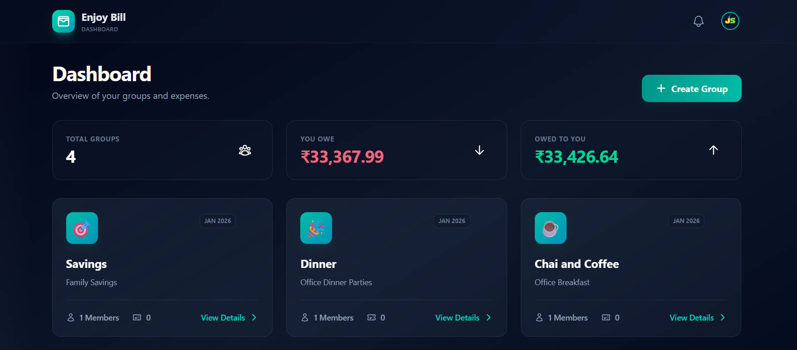
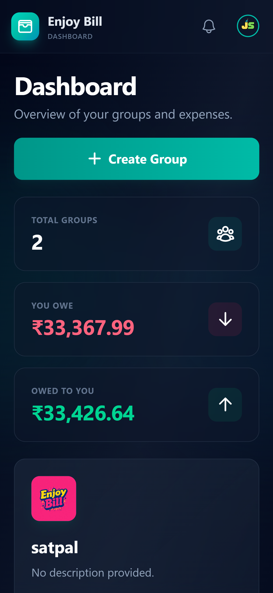

# Enjoy Bill 💸

> **Effortless Expense Tracking & Splitting**

Find financial clarity in a cozy, organized space. Track, split, and relax. Enjoy Bill makes managing shared expenses with friends, roommates, and family simple and stress-free.

<p align="center">
  
  &nbsp; &nbsp;
  
</p>

## ✨ Features

- **🚀 Smart Group Management**: Create groups for trips, households, or occasional outings.
- **💰 Expense Tracking**: Easily record expenses and see who paid what.
- **➗ Fair Splitting**: Split bills equally or customize amounts for each person.
- **📉 Real-time Balances**: Instantly see who owes whom and how much.
- **✅ Settle Up**: Mark debts as paid with a single tap.
- **📊 Dashboard Overview**: Get a high-level view of your total debts and credits.
- **🔐 Secure Authentication**: Powered by Supabase for secure user management.
- **📱 Responsive Design**: Works seamlessly on desktop, tablet, and mobile.

## 🛠️ Tech Stack

- **Frontend**: [Angular v21](https://angular.dev/)
- **Styling**: [Tailwind CSS v4](https://tailwindcss.com/)
- **Backend / Auth**: [Supabase](https://supabase.com/)
- **State Management**: Angular Signals
- **Testing**: Vitest

## 🚀 Getting Started

Follow these steps to set up the project locally.

### Prerequisites

- Node.js (Latest LTS recommended)
- npm

### Installation

1.  **Clone the repository**
    ```bash
    git clone https://github.com/Satpal777/enjoy-bill.git
    cd enjoy-bill
    ```

2.  **Install dependencies**
    ```bash
    npm install
    ```

3.  **Environment Setup**
    Create a `.env` file in the root directory (or `.env.local`) and add your Supabase credentials:
    ```env
    NG_APP_SUPABASE_URL=your_supabase_url
    NG_APP_SUPABASE_KEY=your_supabase_anon_key
    ```

4.  **Run the development server**
    ```bash
    ng serve
    ```
    Navigate to `http://localhost:4200/`. The app will automatically reload if you change any of the source files.

## 📦 Build

Run `ng build` to build the project. The build artifacts will be stored in the `dist/` directory.

## 🧪 Tests

Run `ng test` to execute unit tests via [Vitest](https://vitest.dev/).

## 🤝 Contributing

Contributions are welcome! Please feel free to submit a Pull Request.

1.  Fork the project
2.  Create your feature branch (`git checkout -b feature/AmazingFeature`)
3.  Commit your changes (`git commit -m 'Add some AmazingFeature'`)
4.  Push to the branch (`git push origin feature/AmazingFeature`)
5.  Open a Pull Request

## 📄 License

This project is open source and available under the [MIT License](LICENSE).
